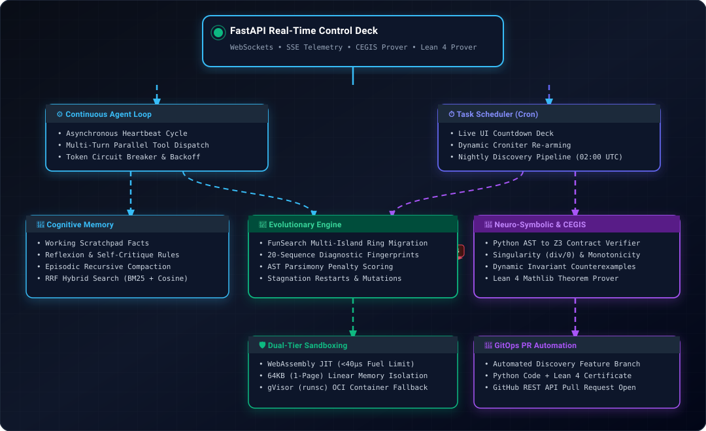
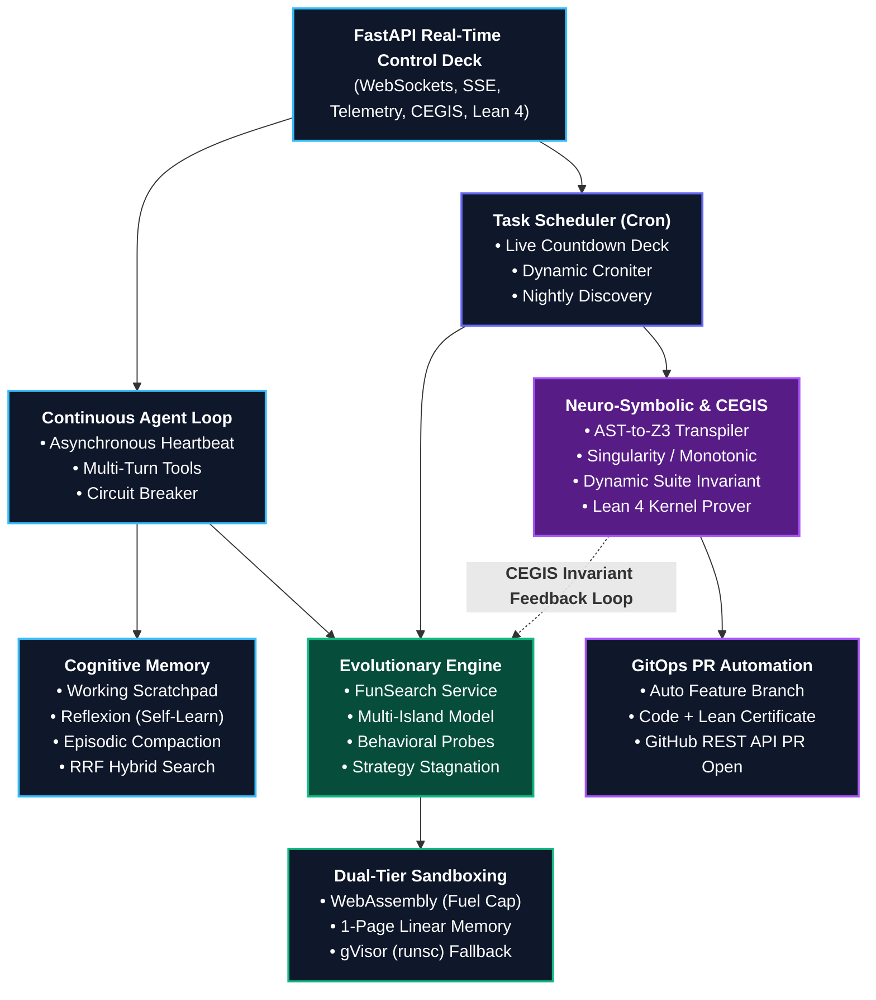

# 🤖 Continuous Autonomous Discovery Agent

> An autonomous neuro-symbolic discovery system integrating a continuous execution heartbeat, cognitive memory with recursive compaction, RRF hybrid RAG search, multi-island evolutionary search (FunSearch), Counterexample-Guided Inductive Synthesis (CEGIS) with Z3, formal verification via Lean 4, dual-tier WASM/gVisor sandboxing, and automated GitHub GitOps PR publishing.

---

## ⚡ Architectural Overview

<p align="center">
  
</p>

<details>
<summary><b>🔍 View Interactive Mermaid Topology</b></summary>


</details>

---

## 📋 Mandatory Prerequisites

| Layer | Dependency | Fallback / Impact If Missing |
|---|---|---|
| **LLM Provider** | `OPENAI_API_KEY` (or Anthropic/Custom) in `.env` | Island mutations and prompt synthesis require an active API key. |
| **SMT & Formal Proofs** | `elan` (Lean 4 compiler) + `z3-solver` | Synthesizes Lean 4 code; verification requires `elan` toolchain on PATH. |
| **Container Sandbox** | Host Docker daemon with `runsc` (gVisor) runtime | **Automatic fallback**: If Docker is offline, system automatically evaluates programs in-process via WebAssembly or local simulation. |
| **WASM Runtime** | `wasmtime` Python wheel | Sub-millisecond in-process evaluations (<40µs). |
| **GitOps (Optional)** | `GITHUB_TOKEN` + `GITHUB_REPO` | Automated branch, commit, and PR creation via GitHub REST API. |

---

## 🚀 One-Command Automated Setup (Linux / macOS)

Run the included bootstrapping script to install Lean 4 via `elan`, configure a virtual environment, install Python requirements, build the optional Docker evaluator image, and run pre-flight diagnostics:

```bash
git clone https://github.com/AmithKumar1/continuous-agent.git
cd continuous-agent
chmod +x setup.sh
./setup.sh
```

Then edit `.env` with your API keys and launch:

```bash
source .venv/bin/activate
python main.py
```

---

## 📦 How to Run (2 Setup Paths)

### Path A: Docker (Recommended)

The bundled `Dockerfile` automatically installs `elan`, builds the Lean 4 compiler, and installs `z3` and `wasmtime`.

1. **Clone and create the environment file**:
   ```bash
   git clone https://github.com/AmithKumar1/continuous-agent.git
   cd continuous-agent
   cp .env.example .env
   # Add your OPENAI_API_KEY, AGENT_API_TOKEN, etc.
   ```

2. **Build the evaluator image used for container sandboxing**:
   ```bash
   docker build -t algo-sandbox:latest -f Dockerfile.evaluator .
   ```

3. **Launch the container stack**:
   ```bash
   docker compose up --build -d
   ```

Open your browser at `http://localhost:8000`.

---

### Path B: Bare-Metal Local Machine

If running directly on macOS, Linux, or Windows without Docker:

1. **Install Lean 4 via `elan`** (macOS/Linux):
   ```bash
   curl -sSf https://raw.githubusercontent.com/leanprover/elan/master/elan-init.sh | sh -s -- -y --default-toolchain leanprover/lean4:stable
   source $HOME/.elan/env
   ```

2. **Install Python requirements**:
   ```bash
   pip install -r requirements.txt
   ```

3. **Run pre-flight verification**:
   ```bash
   python preflight.py
   ```

4. **Start the daemon**:
   ```bash
   python main.py
   ```

---

## 🎨 Interactive Control Deck Components

The FastAPI dashboard (`http://localhost:8000`) provides real-time telemetry over WebSockets:

1. **Dynamic Animated SVG Pipeline Flowchart**:
   - Live visual progression: `Islands` ➔ `WASM Sandbox` ➔ `Z3 SMT Prover` ➔ `Lean 4 Kernel` ➔ `GitOps Dispatch`.
   - Reverse rose-tinted CEGIS counterexample feedback beam on invariant violations.
   - Dynamic stage controller with glowing SVG filters.

2. **High-DPI Canvas Radar Chart (`Island Population Dynamics`)**:
   - Multi-axis behavioral tracking across 5 dimensions: *Peak Fitness*, *Cluster Diversity*, *AST Parsimony*, *Throughput*, and *Invariant Soundness*.
   - Retina-scaled rendering (`devicePixelRatio`).
   - Euclidean distance hit-testing (<18px) with pulsing halos and floating glassmorphic tooltip.

3. **Nightly Discovery Scheduler**:
   - Live countdown display for cron-scheduled discovery runs (default `0 2 * * *`).
   - Preset buttons and manual immediate dispatch trigger.

4. **Neuro-Symbolic CEGIS & Lean 4 Prover**:
   - Interactive heuristic editor with Singularity test presets.
   - Live Z3 SMT contract checking with counterexample extraction.
   - Lean 4 formal proof certificate generation and GitHub PR creation.

---

## 🛠️ Testing & Verification

```bash
# Test WebAssembly JIT execution & fuel limits
python test_wasm_sandbox.py

# Test Lean 4 proof synthesis
python test_lean_verify.py
```

---

## 📡 API Reference

| Method | Endpoint | Description |
|---|---|---|
| `GET` | `/` | Web operator dashboard UI |
| `GET` | `/api/status` | Current heartbeat iteration and agent state |
| `POST` | `/api/pause` | Pause agent heartbeat loop |
| `POST` | `/api/resume` | Resume agent heartbeat loop |
| `POST` | `/api/trigger` | Trigger immediate single-cycle step |
| `GET` | `/api/memory/core` | Read active working scratchpad |
| `POST` | `/api/memory/core` | Set or update working scratchpad key/value |
| `GET` | `/api/memory/heuristics` | Fetch learned operational rules |
| `GET` | `/api/memory/search?q=...` | Hybrid RRF episodic memory search |
| `POST` | `/api/funsearch/start` | Launch multi-island evolutionary search |
| `GET` | `/api/funsearch/telemetry` | Real-time evolutionary search telemetry |
| `POST` | `/api/cegis/probe` | Run Z3 contract verification on heuristic code |
| `POST` | `/api/verify/lean` | Synthesize and check Lean 4 proof certificate |
| `POST` | `/api/gitops/create-pr` | Open GitHub PR for verified heuristic |
| `GET` | `/api/scheduler/status` | Cron schedule status and live countdown |
| `POST` | `/api/scheduler/update` | Update cron schedule pattern |
| `POST` | `/api/scheduler/trigger-now`| Launch overnight discovery pipeline immediately |
| `WS` | `/ws/telemetry` | Real-time WebSocket event stream |

---

## 🔒 Security Architecture

- **Isolated Storage**: Local SQLite databases (`agent_state.db`) and ChromaDB vector collections (`chroma_data/`) are isolated and omitted from source control.
- **Scope Restriction**: Autonomous security audits enforce explicit host allowlisting (`SECURITY_SCAN_ALLOWED_HOSTS`).
- **Deadlock-Free Lock Ordering**: Distributed tool execution enforces ordered resource locks to prevent concurrency deadlocks.
- **Resource Limits**: WASM execution enforces explicit fuel depletion bounds; gVisor fallback enforces read-only root filesystems and process limits.
- **Authentication**: REST API and WebSocket channels secured via `X-API-Key` or `Authorization: Bearer <token>`.

---

## 📄 License

MIT License. See [LICENSE](LICENSE) for details.
